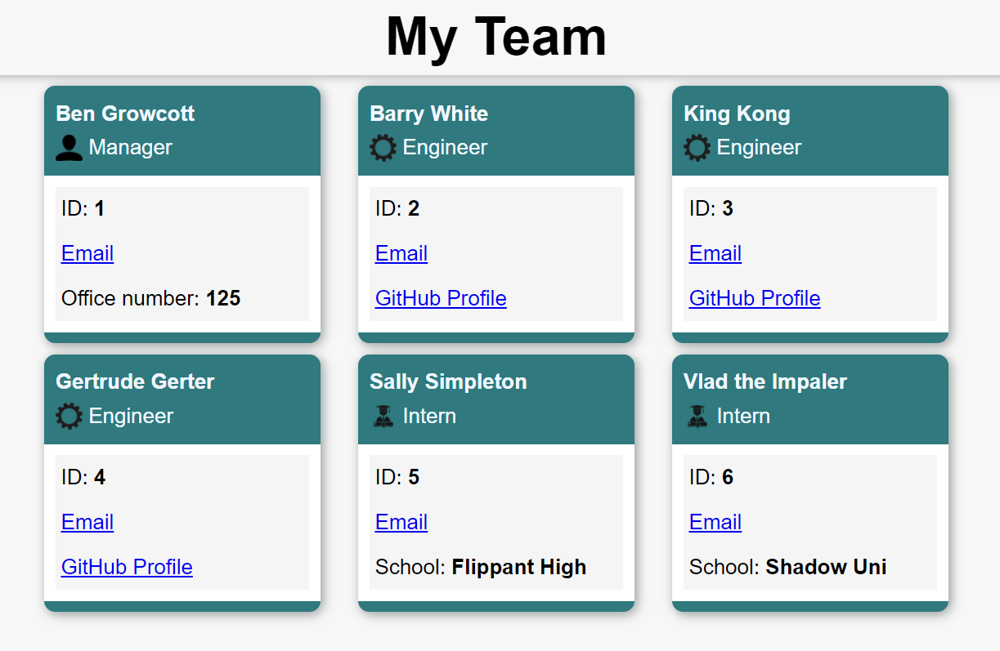

# Team Profile Generator

## Description

Node.js command-line application that takes in information about employees on a software engineering team, then generates an HTML webpage that displays summaries for each person.

## Table of Contents

1. [Installation](#installation)
2. [Usage](#usage)
3. [License](#license)
4. [Contributing](#contributing)
5. [Tests](#tests)
6. [Questions](#questions)

## Installation

1. Git clone this repository
2. Navigate to the correct directory in your command line
3. Run command: npm install
4. Run command: node index.js
5. Answer the prompts!

## Usage

- Upon running the application a user is prompted for team members and their information.
    - The user is prompted to enter the team manager’s name, employee ID, email address, and office number.
    - Once that information is entered the user is presented with a menu with the option to add an engineer or an intern or to finish building the team.
    - Upon selecting to add another team member the user is prompted to enter the engineer’s/intern's name, ID, email, and GitHub username/school, then taken back to the menu.
    - When the user chooses to finish building their team the application stops and an index.HTML file is created.

- The HTML file generated displays a nicely formatted team roster based on user input.
    - Clicking on a team member's email opens in the user's default email programme.
    - Clicking on a Github username open the profile in a new tab.

Please check out this video of the application in action - [Video](https://drive.google.com/file/d/1it2xqKNf7GNhELC38-EbI44I1DlBEzLS/view?usp=sharing)

### Screenshot of sample HTML

The sample can be found in the dist folder.
## License

This project is covered under the MIT License.

## Contributing

Ben Growcott - [GitHub](https://github.com/BGrowcott)

## Tests

There is a test suite for each employee class. Tests are run using Jest via command: npm test

## Questions

If you have any questions or suggestions please contact me via my GitHub or Email:

[GitHub](https://github.com/BGrowcott)

[Email](mailto:bg.coding101@gmail.com)